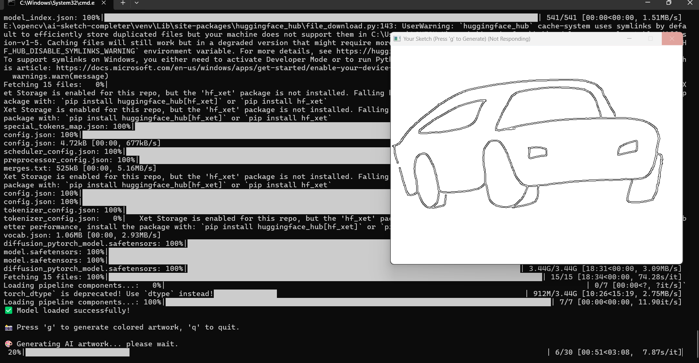
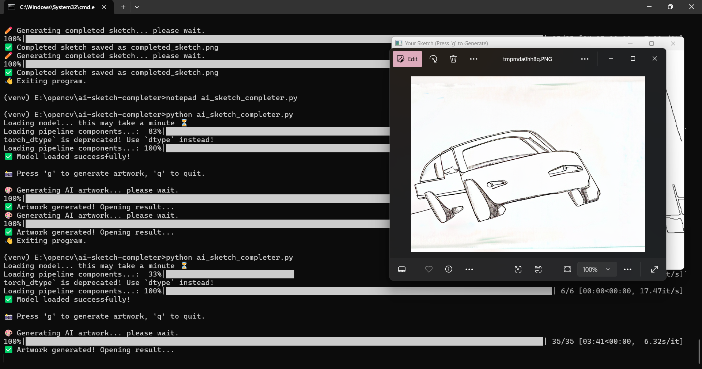
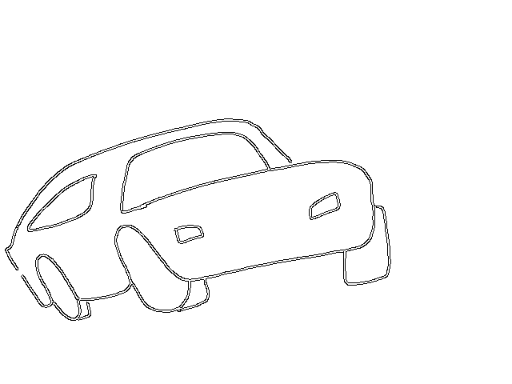
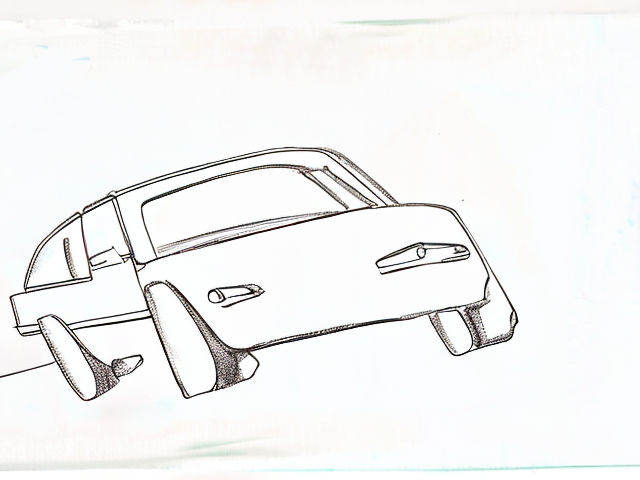

# 🎨 AI Sketch Completer

Transform your hand-drawn sketches into stunning AI-generated artwork in real-time using Stable Diffusion!

## 🌟 Overview

This project uses your webcam to capture hand-drawn sketches and converts them into beautiful, colorful paintings using Stable Diffusion AI. Simply draw something in front of your camera, press a key, and watch as AI transforms your sketch into a complete artwork.

## ✨ Features

- 🖌️ **Real-time Sketch Detection**: Uses OpenCV's Canny edge detection to capture your drawings
- 🤖 **AI-Powered Completion**: Leverages Stable Diffusion 2.0 to generate realistic, colorful paintings
- 📸 **Webcam Integration**: Draw on paper in front of your camera - no drawing tablet needed!
- ⚡ **GPU Acceleration**: Supports CUDA for faster generation (falls back to CPU if unavailable)
- 💾 **Auto-Save**: Automatically saves both sketch and result images

## 🖼️ Demo

### Input: Hand-Drawn Sketch



### Captured Edge Detection


### Output: AI-Generated Artwork


## 🚀 Installation

### Prerequisites
- Python 3.8 or higher
- Webcam
- (Optional) NVIDIA GPU with CUDA support for faster generation

### Setup

1. **Clone the repository**
   ```bash
   git clone <repository-url>
   cd ai-sketch-completer
   ```

2. **Create a virtual environment** (recommended)
   ```bash
   python -m venv venv
   
   # On Windows:
   venv\Scripts\activate
   
   # On macOS/Linux:
   source venv/bin/activate
   ```

3. **Install dependencies**
   ```bash
   pip install -r requirements.txt
   ```

   **For CUDA GPU support** (recommended for faster generation):
   ```bash
   pip install torch torchvision --index-url https://download.pytorch.org/whl/cu118
   ```

4. **Download the AI model** (automatic on first run)
   - The Stable Diffusion model (~5GB) will download automatically when you first run the program
   - Ensure you have a stable internet connection

## 📖 Usage

1. **Run the application**
   ```bash
   python ai_sketch_completer.py
   ```

2. **Draw your sketch**
   - Hold up a piece of paper with your drawing to the webcam
   - Or draw something on a whiteboard/blackboard
   - The program will show edge-detected version in real-time

3. **Generate artwork**
   - Press **'g'** to generate AI artwork from your current sketch
   - Wait a few seconds while the AI processes your sketch
   - The result will automatically open and save as `result.png`

4. **Exit**
   - Press **'q'** to quit the application

## ⌨️ Keyboard Controls

| Key | Action |
|-----|--------|
| `g` | Generate AI artwork from current sketch |
| `q` | Quit the application |

## 📁 Output Files

The program generates the following files:

- `sketch.png` - The edge-detected sketch captured from webcam
- `result.png` - The AI-generated colorful artwork

## 🛠️ Technical Details

### Technologies Used

- **OpenCV**: Real-time image processing and edge detection
- **Stable Diffusion 2.0**: State-of-the-art text-to-image AI model
- **Diffusers**: Hugging Face library for running diffusion models
- **PyTorch**: Deep learning framework for model inference
- **PIL/Pillow**: Image manipulation and saving

### How It Works

1. **Capture**: Webcam frames are captured using OpenCV
2. **Edge Detection**: Canny edge detection extracts sketch lines from the image
3. **Preprocessing**: The sketch is converted to a clean black-and-white image
4. **AI Generation**: Stable Diffusion img2img pipeline transforms the sketch using the prompt:
   - *"complete this pencil sketch into a realistic, colorful painting"*
5. **Output**: The generated artwork is displayed and saved

### Model Parameters

- **Strength**: 0.7 (controls how much the AI transforms the input)
- **Guidance Scale**: 7.5 (controls how closely AI follows the prompt)
- **Model**: stabilityai/stable-diffusion-2

## 🎯 Tips for Best Results

- ✏️ Use **bold, clear lines** in your sketches
- 📝 Draw on **white or light-colored paper** for better contrast
- 💡 Ensure **good lighting** without glare
- 🖼️ Keep the sketch **centered** in the camera frame
- 🎨 Simple shapes work great - try faces, animals, objects, landscapes

## ⚙️ Configuration

You can modify the AI generation parameters in `ai_sketch_completer.py`:

```python
result = pipe(
    prompt="complete this pencil sketch into a realistic, colorful painting",
    image=init_image,
    strength=0.7,        # 0.0 to 1.0 - higher = more transformation
    guidance_scale=7.5   # How closely to follow the prompt
).images[0]
```

### Strength Parameter
- **0.1-0.3**: Minimal changes, keeps sketch structure
- **0.5-0.7**: Balanced transformation (default)
- **0.8-1.0**: Heavy transformation, more creative

### Guidance Scale
- **5-7**: More creative, less literal
- **7-10**: Balanced (default)
- **10-15**: More literal interpretation of prompt

## 🐛 Troubleshooting

### Webcam Not Opening
```bash
# Test your webcam index (try 0, 1, or 2)
cap = cv2.VideoCapture(0)  # Change the number if needed
```

### Out of Memory Error (GPU)
- Reduce image size before processing
- Use CPU mode (automatic fallback)
- Close other GPU-intensive applications

### Slow Generation
- Install CUDA version of PyTorch for GPU acceleration
- Use a smaller Stable Diffusion model variant
- Consider using online GPU services like Google Colab

### Model Download Fails
- Check your internet connection
- Ensure you have ~5GB free disk space
- Manually download from [Hugging Face](https://huggingface.co/stabilityai/stable-diffusion-2)

## 📋 System Requirements

### Minimum
- CPU: Intel i5 or AMD equivalent
- RAM: 8GB
- Storage: 10GB free space
- Python: 3.8+

### Recommended
- CPU: Intel i7/AMD Ryzen 7 or better
- RAM: 16GB+
- GPU: NVIDIA GPU with 6GB+ VRAM (GTX 1060 or better)
- Storage: 10GB+ free space
- Python: 3.10+

## 📜 License

This project uses:
- **Stable Diffusion 2.0**: Licensed under CreativeML Open RAIL++-M License
- **OpenCV**: Apache 2.0 License
- **Diffusers**: Apache 2.0 License

Please review the individual licenses for commercial use restrictions.

## 🤝 Contributing

Contributions are welcome! Feel free to:
- Report bugs
- Suggest new features
- Submit pull requests
- Improve documentation

## 🙏 Acknowledgments

- [Stability AI](https://stability.ai/) for Stable Diffusion
- [Hugging Face](https://huggingface.co/) for the Diffusers library
- [OpenCV](https://opencv.org/) for computer vision tools

## 📞 Support

If you encounter issues or have questions:
- Check the troubleshooting section
- Review [Diffusers documentation](https://huggingface.co/docs/diffusers)
- Open an issue on GitHub

---

**Made with ❤️ and AI**

*Transform your sketches into art in seconds!*
